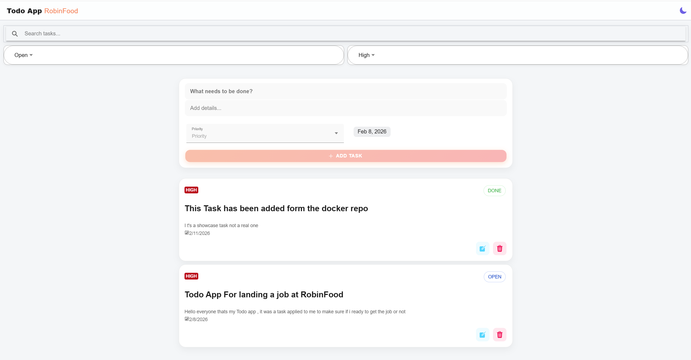
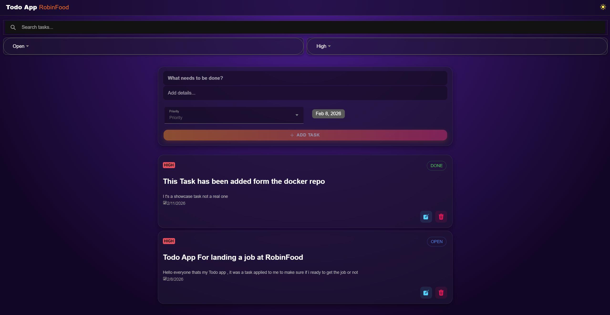
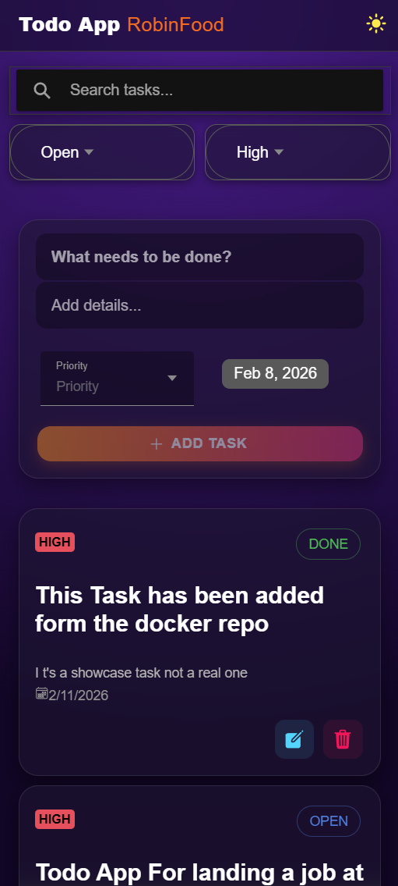

# Task Manager App

A modern, full-stack Task Management application built with performance and UX in mind. Featuring a Glassmorphism UI, Dark/Light mode, and smooth animations.

---

## ✨ Features

- **🎨 Modern UI/UX:** Glassmorphism design with Framer Motion animations.
- **🌗 Dark & Light Mode:** Automatic system detection with a manual toggle switch.
- **⚡ Tech Stack:**
  - **Frontend:** React, Ionic Framework, Framer Motion.
  - **Backend:** NestJS (Node.js), TypeScript.
  - **Database:** PostgreSQL.
- **🐳 Dockerized:** Fully containerized for easy deployment (Frontend + Backend + DB).
- **🛡️ Safety:** Confirmation popups for critical actions (Delete).
- **🔎 Filtering:** Filter tasks by Status (Open, In Progress, Done) and Priority (Low, Medium, High).

---

## 📸 Screenshots

### Light Mode



### Dark Mode



### Web & Mobile Responsive



---

## ⚠️ Important Note Regarding UI Theme

This application is built using **Ionic Framework**, which deeply integrates with your system's and browser's native color scheme preferences.

For the **best visual experience** (especially to enjoy the Glassmorphism effects and correct contrast):

- The app automatically detects your system preference on startup.
- If you switch modes manually using the toggle button ☀️/🌙, **it is recommended that your browser's theme matches the selected mode.**

> **Why?** Ionic components (like Modals and Alerts) inherit base styles from the browser's `prefers-color-scheme` media query. Keeping them in sync ensures 100% color consistency.

---

## 🛠️ Installation & Running

You don't need Node.js or Postgres installed. Just **Docker**!

### 1. Clone the repository

```bash
git clone https://github.com/moaazhf/Task-Management.git
cd Task-Management
```

**Markdown**

### 2. Run with Docker 🐳

This command will build and start the full stack:

**Bash**

```
docker-compose up --build
```

you also can find the image on docker hub:https://hub.docker.com/repository/docker/moaaz20/task-manager

Building Time : 40 ~ 70 sec

 The App is Workng on: http://localhost:3000

3. Environment Variables (Optional)

The project comes with a default configuration in `docker-compose.yml`. However, if you want to customize the database credentials:

1. Rename the example file in the backend folder:
   **Bash**

   ```
   cp backend/.env.example backend/.env
   ```
2. Open `.env` and update the values:
   **Code snippet**

   ```
   DB_PASSWORD=your_secure_password
   DB_DATABASE=task_management
   ```


## 👨‍💻 Author

**Moaaz**

- GitHub: [@MoaazHF](https://github.com/MoaazHF)
- Docker Hub: [moaazhf](https://hub.docker.com/repositories/moaaz20)

---

Made with ❤️ and lots of ☕
